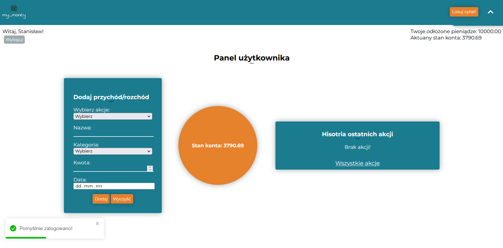

# General info

This project is project for engineering work on studies. Based on architecture client-server with relational database. It is a website where the user manages his budget. The user has the option to add: income, expense, cyclic income/expense. The user has check balance in your panel in application but has option check balance on graphical charts. The user can draw motivating quotes to encourage yourself savings.

I know that this code is not beautiful. This was my first big project wherein I had to wrote backend too. Some components are not reused. I'm still learning and now I would do it differently. Maybe in future I change this code on better. I will think about use useReducer that reduce count useState in project. I want reduce count of components because better do less components but reused than more and not reused.

## Technologies

Project is created with:

- Database: MySQL
- Front-end: React.js + Axios + Chart.js + Toastify.js
- Back-end: Node.js + express.js

## Installation

- Download this project,
- Download or open server(XAMPP,wampp),
- Import database,
- In client and in server install node_modules by `npm install`,
- Run `npm start` for both(I do it on two consoles).

## App appearance

